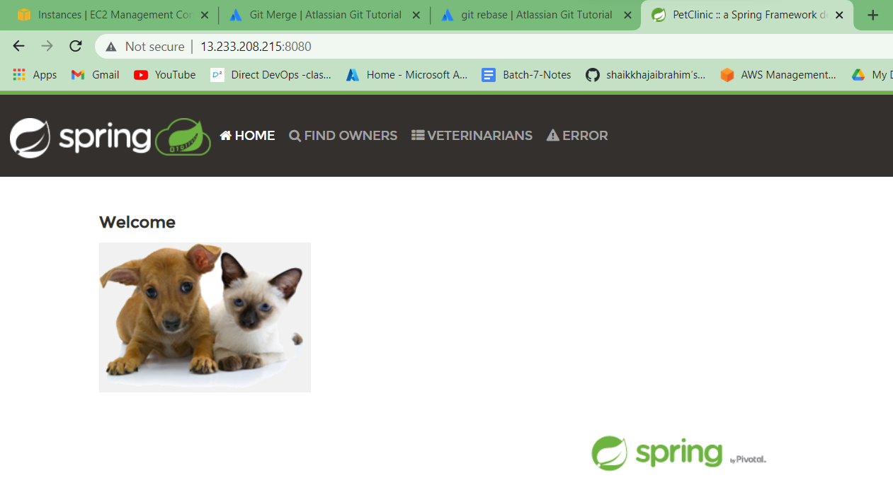
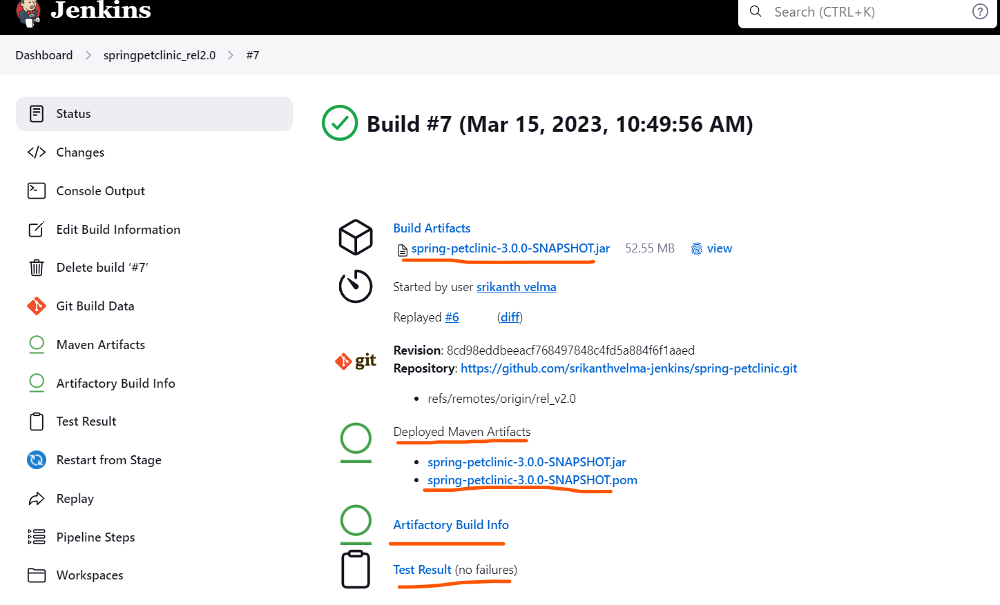

Spring Pet Clinic Project Deployment  from Jenkins (CI/CD) through Ansible Playbook
------------------------------------------------------------------------------------
### Tasks
1. Creating a Jenkins pipeline in develop Branch for Day Build 
2. Create a Jenkins Job for merging pull requset into develop branch
3. Creating a Jenkins pipeline in rel_v1.0 Branch for deployment (s3 bucket)
4. Creating a Jenkins pipeline in rel_v2.0 Branch for deployment (jfrog artifactory) 
   

### 1.Creating a Jenkins pipeline in develop Branch for Day Build 
**Pre-requisites**
* for spc - java 17 & maven 3.8 and above required, to installed in the node
* In jenkins , node(UBUNTU_NODE2) to be configured and running
* In Jenkins => Global Tool Config ,we should config tools req with home path
* Tools - java(JDK_17) and maven(MAVEN_17)
  
  
* Create a Jenkins Job => pipeline type and configure as below process
  
  
* Create a Jenkinsfile in our GitHub in the develop branch with stages as below
  * vcs -version control system
  * build - for maven to build
  * archive & junit results - to  archive artifacts & publish junit results
  * sonar analysis - static code analysis
  * copy the build to any storage - if required
``` js
  pipeline {
    agent { label 'UBUNTU_NODE2'}
   triggers { pollSCM('* * * * *')}
    stages {
        stage('vcs'){
            steps {
                git url: 'https://github.com/srikanthvelma-jenkins/spring-petclinic.git',
                    branch: 'develop'
            }
        }
        stage('build') {
            steps {
                sh 'mvn package'
            }
        }
        stage('postbuild') {
            steps {
                archiveArtifacts artifacts: '**/target/spring-petclinic-3.0.0-SNAPSHOT.jar'
                                 junit '**/surefire-reports/TEST-*.xml'
            }
        }
        stage('sonar analysis') {
            steps {
                 withSonarQubeEnv('SONARQUBE_CLOUD') {
                    sh 'mvn clean verify sonar:sonar \
                        -Dsonar.organization=springpetclinic57\
                        -Dsonar.projectKey=springpetclinic57_petclinic1'
                }
            }
        }
        stage('copy build') {
            steps{
                sh "mkdir -p /tmp/archive/${JOB_NAME}/${BUILD_ID} && cp ./target/spring-petclinic-*.jar /tmp/archive/${JOB_NAME}/${BUILD_ID}/"
                sh "aws s3 sync /tmp/archive/${JOB_NAME}/${BUILD_ID} s3://srikanthcicd --acl public-read-write"
            }
        }
    }
}
```  
  
* As pollSCM is enabled in here it will automatically trigger the pipeline, when the developer pushes the changes to develop branch
* This is the normal scenario for Day Builds 
* But as the developer directly making the commits to develop branch ,it will merge the commits to original code, If developer makes any faulty mistake in his code, it may leads to build failure and it also creates an issue to other developers as it is a failure build
* To overcome this , we may use Pull Request Based work flow
### 2. Create a Jenkins Job for merging pull requset into develop branch
* **Work flow**
* In this type of work flow , normally developers fork the code/repo (develop branch) to his GitHub account, and he writes his code 
* When he wants push/merge the code/changes to main develop branch, now instead of push, he creates a pull request to main develop branch (it may not push/merge authority)
* here we as devops engineers need config/create a pipeline in the main develop branch, such that it will trigger the pipeline on the basis of pull request and it should build the package/artifact.
* Next the result of the build status(pass/failure) should be visible in the main develop branch, so that , the authorized person can decide to merge the changes in to main code or he may reject the pull request
* By doing this , we can easily avoid faulty builds
* To config the pull request based trigger follow below steps
  * need to install  plugin and config `GitHub Pull Request Builder`
  * To config GitHub and jenkins -Credentials are req- we require GitHub token and with that token we can create a `GITHUB_TOKEN`
  
  * To config system. Dashboard=>Manage jenkins=>Configure system
  
  
  * Create a freestyle project with following configuration
  * In General => add a project in GitHUb project url `https://github.com/srikanthvelma-jenkins/spring-petclinic/` 
  
  * In sourece code management => Git => repo url, credentials
  
  * In sourece code management => Git => Advanced => refspec `+refs/pull/*:refs/remotes/origin/pr/*` 
  * In sourece code management =>  Branches to build => branch specifier `${ghprbActualCommit}`
  
  * In Build triggers => GitHub pull request builder => 
  
  
  * In Build Env
  
  * In Build Steps => write build commands
  
  * Next we need to create a webhook in GitHub 
  * Go to repo => settings(project/repo) => webhooks => payload url : `http://<jenkins-ip>:8080/ghprbhook/`, select content type - application/json & let me select individual events - tick pull request & pushes => update hook
   
  

  * Now let us assume the devloper completes his code and raises a pull request to the main develop branch from his github, it will directly trigger to the jenkins 
  
  
  
  
  
  * As shown above after the build result, we can merge (if any conflict, we have clear that).
  * After merging into main develop branch, again it will trigger the pipeline to run with pull code as per pollSCM 
  
  * This completes the general Day Build process with pull request work flow


### 3. Creating a Jenkins pipeline in rel_v1.0 Branch for deployment (s3 bucket)
**Pre-requisites**
* for spc - java 17 & maven 3.8 and above required, to installed in the node
* In jenkins , node(UBUNTU_NODE2) to be configured and running
* In Jenkins => Global Tool Config ,we should config tools req with home path
* Tools - java(JDK_17) and maven(MAVEN_17)
* Create a Jenkins Job => pipeline type
* Create a Jenkinsfile in our GitHub in the **rel_v1.0** branch with stages as below
  * vcs -version control system
  * build - for maven to build
  * archive & junit results - to  archive artifacts & publish junit results
  * sonar analysis - static code analysis
  * copy the build to any storage - copieed to s3 bucket
  * deploy - deploy into other node by using Ansible-Playbook
  * here we require following files
    * Jenkinsfile
    * ansible playbook - spc.yaml
    * service file - spc.service
    * hosts file - hosts.txt
  * Jenkinsfile
```Js 
  pipeline {
    agent { label 'UBUNTU_NODE2'}
   triggers { pollSCM('* * * * *')}
    stages {
        stage('vcs'){
            steps {
                git url: 'https://github.com/srikanthvelma-jenkins/spring-petclinic.git',
                    branch: 'rel_v1.0'
            }
        }
        stage('build') {
            steps {
                sh 'mvn package'
            }
        }
        stage('postbuild') {
            steps {
                archiveArtifacts artifacts: '**/target/spring-petclinic-3.0.0-SNAPSHOT.jar'
                                 junit '**/surefire-reports/TEST-*.xml'
            }
        }
        stage('sonar analysis') {
            steps {
                 withSonarQubeEnv('SONARQUBE_CLOUD') {
                    sh 'mvn clean verify sonar:sonar \
                        -Dsonar.organization=springpetclinic57\
                        -Dsonar.projectKey=springpetclinic57_petclinic1'
                }
            }
        }
        stage('copy build') {
            steps{
                sh "mkdir -p /tmp/archive/${JOB_NAME}/${BUILD_ID} && cp ./target/spring-petclinic-*.jar /tmp/archive/${JOB_NAME}/${BUILD_ID}/"
                sh "aws s3 sync /tmp/archive/${JOB_NAME}/${BUILD_ID} s3://srikanthcicd --acl public-read-write"
            }
        }
        stage('deploy'){
            agent { label 'UBUNTU_NODE1'}
            steps{
                sh 'ansible-playbook -i ./hosts ./spc.yaml'
            }
        }
    }
}
```
  * spc.yaml
```yaml 
---
- name: deploying spc 
  hosts: all
  become: yes
  tasks:
  - name: download jar file from jfrog
    get_url:
      url: "https://srikanthvelma.jfrog.io/artifactory/libs-snapshot-local/org/springframework/samples/spring-petclinic/3.0.0-SNAPSHOT/spring-petclinic-3.0.0-20230309.061207-7.jar"
      dest: /home/ubuntu
      url_username: 'velmasrikanth@gmail.com'
      url_password: 'cmVmdGtuOjAxOjE3MDk3MTM0MjQ6ZjBadGVSdFlKWFFxUHdaVnpDVzA2T3NXMThF'
      mode: '0777'
  - name: copy spc service file
    copy:
      src: spc.service
      dest: /etc/systemd/system/
      mode: '0777'
  - name: start service file
    systemd:
      name: spc.service
      daemon_reload: yes
      enabled: yes
      state: started
```
  * spc.service
```Json 
[Unit]
Description=Springpetclinic service

[Service]
User=ubuntu
WorkingDirectory=/home/ubuntu
ExecStart=/usr/bin/java -jar /home/ubuntu/spring-petclinic-3.0.0-SNAPSHOT.jar
SuccessExitStatus=101
TimeoutStopSec=10
Restart=on-failure
RestartSec=5

[Install]
WantedBy=multi-user.target
```
  * hosts.txt
```
localhost
```



* By this SPC is deployes succesfully in a VM by using ansible-playbook through Jenkins pipeline.


### 4. Creating a Jenkins pipeline in rel_v2.0 Branch for deployment (jfrog artifactory)
* Here this is exactly similar to above task 3 process, only change is in this we upload the artifact to jfrog artifactory
* for this we have configure jfrog artifactory in jenkins
* When we creating a account of jfrog we will get username and password (as a token), if we dont know the username and password - `username is our mail id` and password we can generate by using `setme up` option in jfrog account settings

* first we can setup credentials for jfrog 
  
* we have to install `Artifactory Plugin`
* Config the jfrog platform instance in Manage jenkins => Configure system
  
  

* Create a Jenkins Job => pipeline type
* Create a Jenkinsfile in our GitHub in the **rel_v2.0** branch with stages as below
  * vcs -version control system
  * Artifactory config
  * build & publish & upload to jfrog -rtMaven run
  * sonar analysis
  * Archiving artifacts & Junit results
  * deploy - ansible-playbook(downloding artifact from jfrog)
  * Jenkinsfile
```Js
pipeline {
    agent { label 'UBUNTU_NODE2'}
    triggers { pollSCM('* * * * *')}
    stages {
        stage('vcs'){
            steps {
                git url: 'https://github.com/srikanthvelma-jenkins/spring-petclinic.git',
                    branch: 'rel_v2.0'
            }
        }
        stage('Artifactory config') {
            steps {
                rtServer (
                    id: "ARTIFACTORY_SERVER",
                    url: 'https://srikanthvelma.jfrog.io/artifactory',
                    credentialsId: 'JFROG_KEY'
                )
                rtMavenDeployer (
                    id: "MAVEN_DEPLOYER",
                    serverId: "ARTIFACTORY_SERVER",
                    releaseRepo: 'libs-release',
                    snapshotRepo: 'libs-snapshot'
                )    
            }
        }
        stage('build') {
            steps {
                rtMavenRun (
                    tool: 'MAVEN_17',
                    pom: 'pom.xml',
                    goals: 'clean install',
                    deployerId: "MAVEN_DEPLOYER"
                )
                rtPublishBuildInfo (
                    serverId: "ARTIFACTORY_SERVER"
                )
            }
        }
        stage('sonar analysis') {
            steps {
                 withSonarQubeEnv('SONARQUBE_CLOUD') {
                    sh 'mvn clean verify sonar:sonar \
                        -Dsonar.organization=springpetclinic57\
                        -Dsonar.projectKey=springpetclinic57_petclinic1'
                }
            }
        }
        stage('archiving artifact & junit results') {
            steps {
                archiveArtifacts artifacts: '**/target/spring-petclinic-*.jar'
                                 junit '**/surefire-reports/TEST-*.xml'
            }
        }
        stage('deploy'){
            agent { label 'UBUNTU_NODE1'}
            steps{
             
                sh 'ansible-playbook -i ./hosts ./spc.yaml'
            }
        }
    }
}

```
* spc.yaml
```Js
---
- name: deploying spc 
  hosts: all
  become: yes
  tasks:
  - name: download jar file from jfrog
    get_url:
      url: "https://srikanthvelma.jfrog.io/artifactory/libs-snapshot-local/org/springframework/samples/spring-petclinic/3.0.0-SNAPSHOT/spring-petclinic-3.0.0-20230309.061207-7.jar"
      dest: /home/ubuntu
      url_username: 'velmasrikanth@gmail.com'
      url_password: 'cmVmdGtuOjAxOjE3MDk3MTM0MjQ6ZjBadGVSdFlKWFFxUHdaVnpDVzA2T3NXMThF'
      mode: '0777'
  - name: copy spc service file
    copy:
      src: spc.service
      dest: /etc/systemd/system/
      mode: '0777'
  - name: start service file
    systemd:
      name: spc.service
      daemon_reload: yes
      enabled: yes
      state: started
```


 


  
   